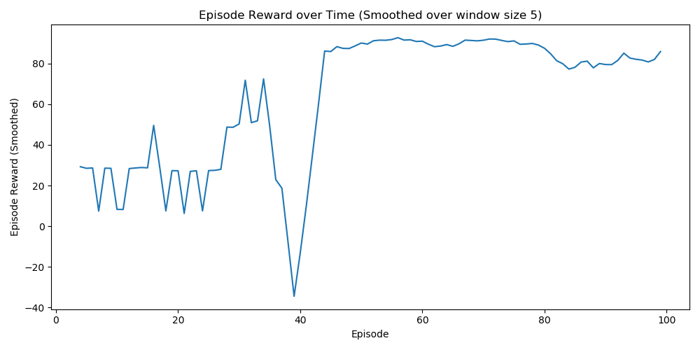
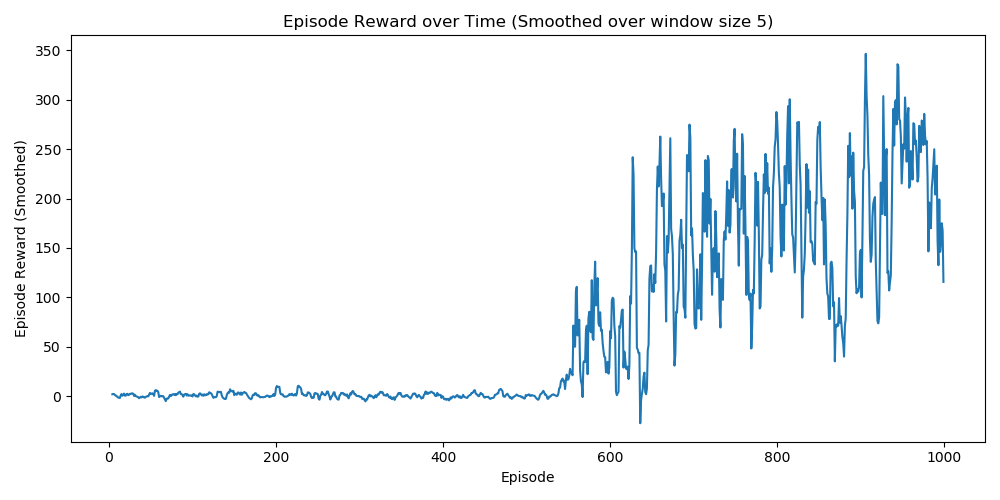

# Soft Actor-Critic TF2
This work aims to implement, train, and test the Soft Actor-Critic algorithm using Python and TensorFlow 2.1.0. This recent reinforcement learning algorithm is defined off-policy because it is independent of the policy used, meaning that the agent could behave randomly. In fact, in the first part of the learning process, the agent will gather information from random moves and this randomness will slow down over time. In particular, with SAC we speak about entropy regularized reinforcement learning.

This implementation has been tested using [MountainCarContinuous-v0](https://gym.openai.com/envs/MountainCarContinuous-v0/) and [Walker2d-v2](https://gym.openai.com/envs/Walker2d-v2/) Gym environments.

See [Report](report.pdf).

*"La Sapienza" University of Rome - MSc in Artificial Intelligence and Robotics*, Reinforcement Learning 2019/2020

## MountainCarContinuous-v0
 

## Walker2d-v2
 
